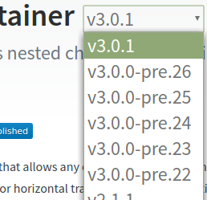
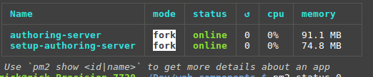

# Atelier TP 2 MOGGLE
## Objectif, ludification et organisation du TP
Obectif : créer un nouveau composant de jeu et intégrer entièrement ce composant à l'éditeur MOGGLE. 

A l'issue du TP MOGGLE disposera : 
* D'une nouvelle page pour ce composant
  * Permettant de créer de nouvelles instances et lister les instances existance du nouveau composant
  * Permettant la mise à jour (update), la suppression et le partage d'instances du nouveau composant
* D'une option permettant d'ajouter le composant comme activité situé dans les unité de jeux

## Ludification du TP
Afin de ludifier ce TP, vous disposerez d'un **capital de 10 points** chacun en début de TP. Ces points seront utilisées comme monnaie d'échange au cours du TP et vous donneront **un score de génialitude** en fin de TP. 

* **Utilisation des points**
  * Un point peut être **dépensé pour poser une question technique** (et avoir une réponse)
  * Deux points peuvent **être dépensé pour obtenir un fragment de code fonctionnel de 5 lignes**
  * Trois points peuvent être **dépensé en cas de triche (si on se fait prendre)**
  * Arrivé à 0 points, **toute question technique devra être accompagnée d'une idée de composant de jeu**

* **Gain de nouveau points**
  * Toute personne dénonçant une triche qui m'aurait échappé **recevra 3 points**
  * La première personne à finir l'étape 1 **recevra 5 point**
    * La deuxième personne recevra 4 points, la troisième 3...
    * La même décroisance arithmetiques s'applique pour les autres étapes
  * La première personne à finir l'étape 2 **recevra 3 point**
  * La première personne à finir l'étape 3 **recevra 4 point**
  * La première personne à faire un commit fonctionnel sur github recevra **10 points**
  
## Organisation du TP

### Etape 1 (20 min max) : conception du nouveau composant 

Le composant que vous allez créer est de type QCM intégrant **plusieurs bonne réponses possibles** ainsi que **des interactions adaptés au format mobile**. Pour cela, on se basera sur le composant natif Polymer [iron-swipeable-container](https://elements.polymer-project.org/elements/iron-swipeable-container). 

La documentation du composant fournie par le lien concerne Polymer 3.x, nous travaillons avec Polymer 1.x. Pour **visualiser la version correcte de la documentation**, utilisez le bouton Dropdown à droite du nom du composant. Choisir la dernière version publiée pour Polymer 1.x (1.0.3). 



Utilisez ensuite le bouton Démo dans la barre de gauche **pour expérimenter les interactions**. Le composant de jeu devra permettre d'afficher une **jolie liste d'assertion correcte ou incorrecte**. Le joueur aura pour tâche de supprimer les assertions incorrectes, et uniquement celles là, par swipe. 

**Etape de discussion/conception** : 

* Quelle sera l'allure du composant final?
* Quelle **interactions** seront possible (ex. valider une solution)?
* Quels **états** sont possible pour le composant?
* Quelle **logique** pour ces interactions?
* Quelle **propriétés** nécessite le composant pour son édition? 

### Etape 2 (1h max) implémentation et publication du composant

**Créez un nouveau répository** response-swiper-[initiale du nom] dans https://github.com/REVERIES-project. Choisir **initialisez le repository avec un fichier README.md**. En ligne de commande, effectuez un clone local du repository, c'est ce clone que vous éditerez et utiliserez pour les git push.

Depuis le répertoire local du repository, utilisez la commande `$ polymer init` et choisir la première option. Conservez les options par défaut sauf pour le fichier README.md.

**Toujours depuis le terminal**, installez la dernière version 1.0.3 de `iron-swipeable-container` en utilisant l'option --save pour enregistrer la dépendance dans le fichier `Bower.json`. Lancer Visual Studio Code depuis le répertoire du composant.
**Après quoi lancez le service Polymer** et ouvrez dans le navigateur la page de démo.

```bash
$ bower install --save iron-swipeable-container#^1.0.3
$ code .
$ polymer serve
```
**Dans Visual Studio Code**
*  Commencez par **ajouter un fichier .gitignore** contenant une unique ligne : `bower_components`. 
  *  Ceci afin d'éviter de faire des commit inutiles et dangeureux sur le code managé par Bower.
* Quelques conseils pour l'implémentation :
  * Utilisez le template `dom-repeat` pour itérer sur une propriété tableau
  * Le code html aura probablement l'allure suivante (en plus compliqué)
  ```html
      <iron-swipeable-container>
        <template is="dom-repeat" items="[[assertionArray]]">
          <div class="laClasse">
            [[item.assertion]]
          </div>
        </template>
      </iron-swipeable-container>
  ```
  * Il est possible de **connaître les items swippés au fur et à mesure** en écoutant l'évenement **iron-swipe**
```javascript
      ready(){
        this.$.containerId.addEventListener('iron-swipe',this.methodHandlingSwipe.bind(this))
      },
```
**Une fois le composant implémenté et fonctionnel**

* **Faire un push** de la dernière version sur github
  ```bash
     $ git add .
     $ git commit -m "message approprié"
     $ git push
  ```
* **Tagger le composant par un numéro de version** ceci afin de le rendre visible par Bower
  ```bash
     $ git tag -a 0.0.1 -m "v0.0.1"
     $ git push --tags
  ```


### Etape 3 (1h max) intégration du composant dans MOGGLE

L'objectif est **d'intégrer le composant que vous avez développé dans l'éditeur de jeux sérieux**. Pour cela vous **allez travailler sur un fork de l'éditeur**, un fork est une copie du repository dans son état actuel qui vous appartient. **Vous pouvez modifier le fork et faire des commit sans affecter le repository forké.** 

Les forks facilitent la collaboration : si vos modifications ajoutent des fonctionnalités, vous pouvez faire une **pull request**. C'est à dire proposer de brancher votre fork sur le repository d'origine, mettant à jour le repository d'origine avec les nouveaux éléments. La **pull request devra être accepté par un owner du repository d'origine** (ici Pierre-Yves) pour être prise en compte.     

L'installation de MOGGLE en local demande de suivre les étape suivante :
* Créer un fork du repository [reveries-authoring](https://github.com/gick/reveries-authoring). 
* Créer un **clone local du fork** (pas du repository d'origine!)
* Depuis le répertoire cloné **installer les dépendances nécessaires** :
  ```bash
     $ npm install
     $ cd authoring-client
     $ npm install
     $ bower install
     $ cd ..
  ```
* Démarrer l'éditeur MOGGLE localement, tout d'abord lancer le service `mongod` qui permet au serveur de communiquer avec la base de donnée installée localement. Ensuite lancer le service `pm2` qui permet **d'abstraire le serveur sous forme d'un service.** 
  ```bash
     $ sudo service mongod start
     $ pm2 start ecosystem.config.js
  ```

* Si tout c'est bien passé vous devriez avoir le résultat suivant à l'écran :

* Tester l'accès local via l'URL : [MOGGLE local](http:\\localhost:8000)
* En cas de problème, `$ pm2 log` fournit les dernières écritures sur `stdout` et `stderr`


